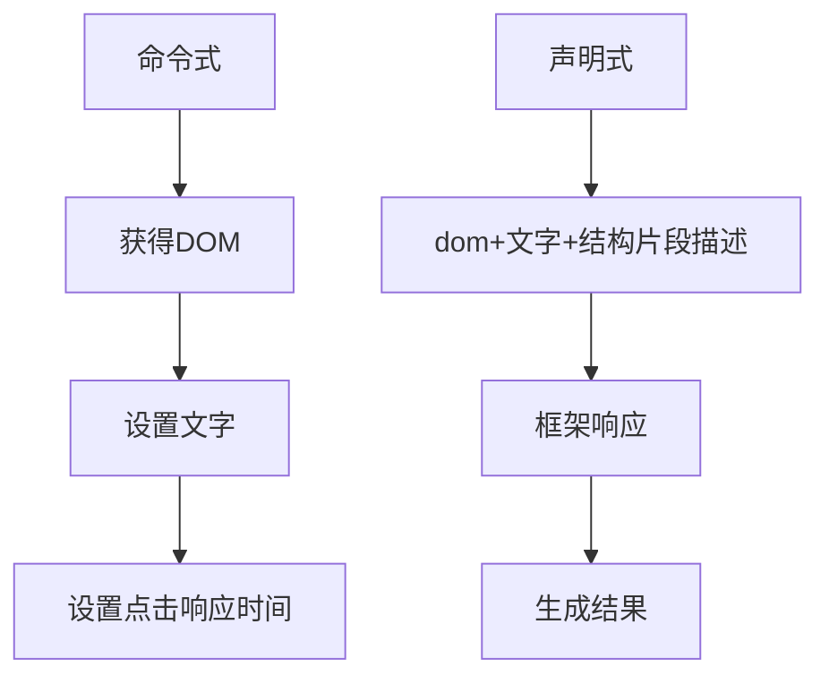

<!--
 * @Author: GAtomis 850680822@qq.com
 * @Date: 2022-12-19 15:30:01
 * @LastEditors: GAtomis 850680822@qq.com
 * @LastEditTime: 2022-12-20 11:03:56
 * @FilePath: /workspace/gatomis-read-about/VueJS设计与实现-hcy/Chapter-I/Chapter-I.md
 * @Description: 这是默认设置,请设置`customMade`, 打开koroFileHeader查看配置 进行设置: https://github.com/OBKoro1/koro1FileHeader/wiki/%E9%85%8D%E7%BD%AE
-->

## 前言
最近重新翻了一下书堆发现一本绝世好书《vuejs设计与实现》——霍春阳，里面描述了vue框架的实现思路，也详细的介绍了vue各个模块设计实现思路，激发了我将它读下去的欲望，为了加强自制力（其实是懒），我会每天尽量分享我的读书笔记以及个人理解。如果大家感兴趣可以去商城买一本支持我们的霍春阳大大，这本书真的很好。

## 第一章 框架设计概念
本章讲述的是vue3雏形实现选择思路，以及框架设计需要具备的思想
### Topic
* 命令式和声明式
* 虚拟dom的与传统dom操作性能
* 框架设计选择运行时和编译时

### 命令式和声明式
在设计范式上我们日常传统开发的思维都是命令式开发思维,比较在乎开发过程，声明式框架与命令式框架不同，更加关注于结果，下面我就用修改文字的过程解释上面的话


以上例子发现声明式的特点在于用户根本不需要关系如同命令式一般的生成过程，只需要提供一个需求的抽象描述或者解析片段,在通过框架响应生成结果,在此期间用户根本不需要关心过程。
### 虚拟dom的与传统dom操作
上面说道vue设计思路是基于声明式范式设计,这里就离不开vue的核心-虚拟dom，按照书上虚拟dom其实是dom结构的抽象描述,例如一下
```
//html
<div class="btn" ><span>GAtomis最帅</span></div>
//虚拟dom
const btn={
    tag:"div",
    attribute:{
    class:"btn"
    },
    children:[
    {
     tag:"span",
     children:"GAtomis最帅"
    }
    ]
}
//虚拟dom 遍历生成
const app=[]
for(let i=0;i<1000;i++){
const div={tag:'div'}
app.push(div)
}

//传统dom
const app=document.getElementById('app')
for(let i=0;i<1000;i++){
const div=document.getElementById('div')
app.appendChild(div)
}
```
众所周知dom的回流渲染是比较消耗性能的，理论上虚拟Dom性能消耗=diff找出差异+传统修改dom。理论上多了一步Diff算法是消耗性能大于传统dom渲染,但是如果找能够找出最小颗粒的度差异性能消耗，就可以无限接近命令式消耗。

总结虚拟dom优点
* 心智负担小
* 可维护性强
* 性能不错

### 框架设计选择运行时和编译时
vue3是个编译+运行时的框架,个人理解由于javascript语言的动态特性导致纯编译式语言会让整个框架变得笨重,让本身框架站在了一个个人或者组织习惯的方式进行编码而非中立的角度,灵活性是一个成功框架的必要特性.

### 总结
通过编程范式选择可以很好决定一个框架未来的拓展以及发展发向,通过计算虚拟dom来进行渲染,最大化的增加了代码的可维护性，已经平衡了性能消耗和心智负担,基于灵活的框架运行模式造就渐进式框架的雏形。
### 关于我
一部分demo和笔记我已经放在了
[链接](https://github.com/GAtomis/gatomis-read-about/tree/main/VueJS%E8%AE%BE%E8%AE%A1%E4%B8%8E%E5%AE%9E%E7%8E%B0-hcy)上
以上内容是我对这本书的一些自己的感悟和见解，如果有错误，希望大家努力开喷，赶快纠正我的错误。